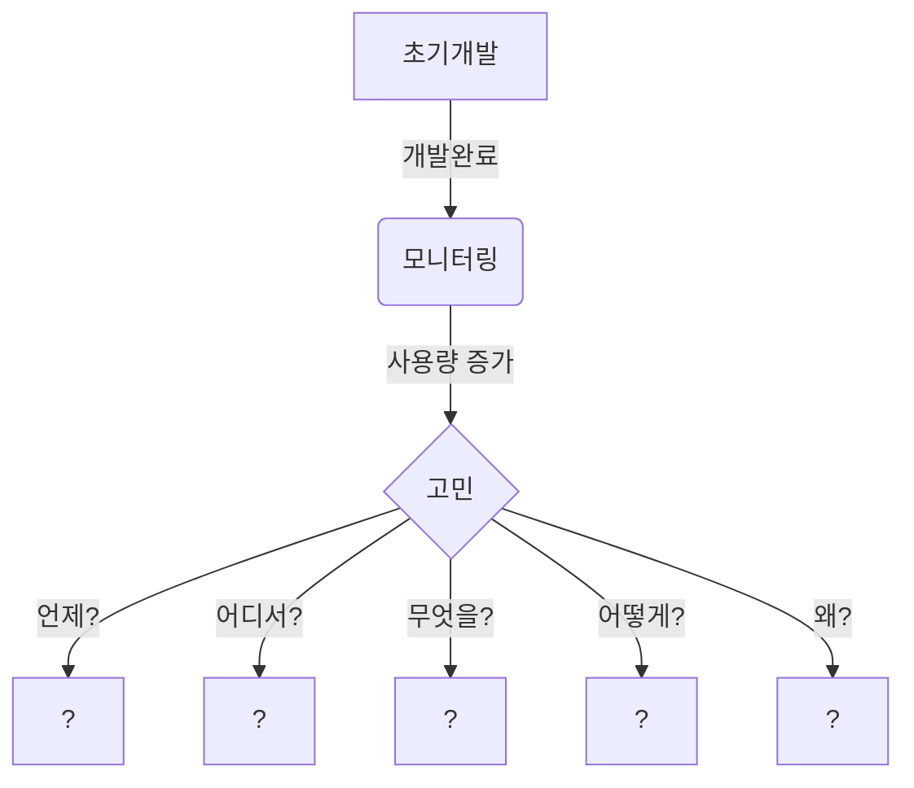

# 사용자 수에 따른 규모 확장성

- 초기 서비스는 Monolithic 시스템을 바탕으로 구성되어야 한다. 
  - 손쉬운 배포 
  - 테스트 간소화
  - 유지보수 편리성
  - 리소스 최적화 
  - 초기 단계 프로젝트 또는 소규모 팀에 적합 

- 초기 서비스에 대한 모니터링을 통해서 확장 시점을 정의 해야 한다. 

## 1. 언제 확장해야 하는가? 

## 2. 언제? 

- 모니터링을 통해서 정량적인 수치를 파악해야한다. 
  - [Pin Point](https://github.com/pinpoint-apm/pinpoint)
  - [Scouter](https://github.com/scouter-project/scouter)
  - [Prometheus](https://prometheus.io/)
  - [Grafana](https://grafana.com/)

### 2-1. 정량적인 수치는 

서비스의 Scale-Up/Scale-Out이 일어나야 하는 시점을 파악하기 위한 임계치를 어떻게 정의할 것인가? 

- CPU 사용량 
- 응답시간
- 오류율 
- 트랙잭션 추적
- 인스턴스 수 
- 요청 
- 가동시간 

## 3. 어디서? 

- OnPremise 인가? 
- Cloud 인가? 

### 3-1. OnPremise 일 경우,

OnPremise 환경은 Cloud 환경과는 달리 확장 방식에 어려움이 있다.   
여기에서 의미하는 OnPremise 환경은 Container 기반의 시스템을 운영하지 않고,  
물리적으로 하드웨어가 고정된 경우를 의미한다.

> OnPremise 환경에서는 ScaleUp 방식이 좀더 쉬울 수 있다. 

### 3-2. Cloud 일 경우, 

하드웨어를 논리적으로 확장할 수 있는 구조이며, 사용자의 트래픽에 좀더 능동적으로 대응 할 수 있다. 

- Virtual Machine 방식
- Container 방식

> Cloud 환경에서는 ScaleOut/ScaleUp을 자유롭게 처리할 수 있으며, ScaleOut을 효과적인 방법으로 처리할 수 있습니다. 

## 4. 무엇을?

### 4-1. 처리할 것인가?

- CPU/Memory 
- Database 
- Cache 
- Network
- Software Architecture
- Static files

### 4-2. ScaleUp을 통한 확장

- 하나를 깊게,

#### 4-2-1. 수직적 규모 확장

- 수직적 규모 확장에는 서버에 고사양 자원(더 좋은 CPU, 더 많은 RAM 등)을 추가하는 행위
- **수직적 규모 확장에는 한계**가 존재한다. 
- 수직적 규모 확장에는 장애에 대한 **자동 복구 방안이나 다중화 방안**을 제시하지 않는다. 
- 서버에 장애가 발생하면 **웹사이트/앱은 완전히 중단**된다.

### 4-3. ScaleOut을 통한 확장 

- 작고 많게,

#### 4-3-1. 수평적 규모 확장 

- 더 많은 서버를 추가하여 성능을 개선하는 행위
- 초기설정이 복잡합니다. 다수의 서버에 대한 설정 및 데이터를 분산시키는 작업에 대한 설정이 어려울 수 있습니다. 
- 데이터 일관성 유지가 어려울 수 있습니다.

## 5. 어떻게?

### 5-0. 이것을 위해서 수직/수평을 고민한다.

#### 5-0-1. 고가용성 ( High Availability )

고가용성은 단어 그대로 시스템이 장애 없이 정상적으로 운영 또는 수행하는 능력을 의미합니다. 즉 `절대 고장이 나지 않음`과 같은 의미라고 할 수 있습니다.

- 고가용성은 중요 시스템과 서비스가 지속해서 운영되어 다운 타임과 중단을 최소화 할 수 있기에 안정적이고 효율적인 운영을 위한 기업 데이터 데이트 환경에 적합함.
  - 로드밸런서
  - 클러스터링 소프트웨어
  - 백업 및 재해 복구 소프트웨어
  - 모니터링 및 관리 소프트웨어

- 고가용성은 중요 시스템과 서비스가 지속해서 운영되어 다운 타임과 중단을 최소화 할 수 있기에 안정적이고 효율적인 운영을 위한 기업 데이터베이스 환경에 적합합니다.
- 또한 기업이 가장 중요하게 생각하는 것은 '비즈니스 연속성' 입니다.

#### 5-0-2. SLA

SLA는 서비스 수준 계약(Service Level Agreement)의 약자로, 서비스 제공자(provider)와 고객(customer) 간의 계약입니다. 
이 계약은 제공되는 서비스의 수준과 품질, 즉 기대되는 서비스 수준을 명확하게 정의하며, 이를 통해 서비스 제공자와 고객 간의 이해를 증진시키고 서비스 품질을 개선하는 데 도움을 줍니다.

### 5-1. 수직적 규모 확장

- 단일 서버의 성능을 높이는 방법으로, CPU, RAM, 디스크 등을 추가하여 서버 자체의 능력을 향상시키는 것입니다

### 5-2. 수평적 규모 확장

#### 5-2-1. 네트워크 ( Network )

##### 5-2-1-1. 로드밸런서

- [OCI 7 계층](https://m.blog.naver.com/hunjison_blog/222902261597)
  - L4 스위치의 로드밸러서 
     - L4 스위치의 로드 밸런서는 위와 같은 형태를 갖추고 있다. 중간의 스위치를 통해 각각의 서버에 접속을 분산시켜 보내주는 역할을 한다. 
     - 전송 계층(Transport Layer)에서 작동하며 IP, Port, Session을 기반으로 한 로드밸런싱을 담당한다. 
     - TCP/UDP 프로토콜을 이용하여 프로토콜의 헤더를 보고 로드 밸런싱을 수행하며 주로 Round Robin 방식을 이용해 부하를 분산한다. 
  - L7 스위치의 로드밸런서
     - L7 스위치는 L4 스위치보다 보안적으로 우수하며 좀 더 정교한 로드밸런싱이 가능하다. 데이터 분석을 통한 DDoS 공격 방어가 가능하고, 감염 패킷의 필터링이 가능하다. 

- 로드 밸런서 
  - 웹 서버들에게 트래픽 부하를 고르게 분산하는 역할을 한다. 
  - [GCP Cloud Load Balancing](https://cloud.google.com/load-balancing)
  - [AWS Elastic Load Balancer](https://aws.amazon.com/ko/elasticloadbalancing/)
  - [Azure Load Balancer](https://learn.microsoft.com/ko-kr/azure/load-balancer/load-balancer-overview)
    - 다양한 계층에 대한 로드밸런서 솔루션들이 존재하지만, 대표적으로 4계층과 7계층에 대한 로드밸런서를 제공합니다.

#### 5-2-2. 데이터베이스 다중화 ( DataBase )

데이터베이스 이중화는 시스템 안정성과 가용성을 높이기 위해 데이터베이스를 복제하여 운영하는 방안입니다. 주로 Active-Standby (활동-대기) 방식과 Active-Active (활동-활동) 방식으로 구현되며, 장애 발생 시 서비스 중단 시간을 최소화하고 데이터 손실을 방지하는 효과가 있습니다.

##### 5-2-2-1. Active-StandBy

한 데이터베이스 서버가 활동 상태로 서비스를 제공하고, 다른 데이터베이스 서버는 대기 상태로 유지됩니다. 활동 데이터베이스 서버에 장애가 발생하면 대기 서버가 자동으로 서비스를 대신 수행합니다.

##### 5-2-2-2. Active-Active 

두 개 이상의 데이터베이스 서버가 동시에 서비스를 제공합니다. 각 서버는 독립적으로 작업을 처리하며, 장애 발생 시 다른 서버가 서비스를 유지합니다.

##### 5-2-2-3. Master-Slave (Active-StandBy)

Master 서버의 기준은 CUD가 가능하다는 것이다. 그에 비해, Slave 서버는 Read가 가능하다.
역할이 달라지는 것이며, 그에 따라 트래픽이 분산될 수 있다.
Master는 데이터 동시성이 아주 높은 트랜잭션을 담당하고, Slave는 데이터 동시성이 꼭 필요없는 경우에 읽기 전용으로 데이터를 가져온다.

##### 5-2-2-4. 어떻게 데이터를 동기화할 것인가

- 동기식 복제 
  - 데이터가 주 데이터베이스에 쓰일 때, 동시에 하나 이상의 복제본에 동일한 데이터를 쓰는 방식입니다.
  - 데이터의 일관성을 보장하지만, 지연(latency)이 발생할 수 있습니다.
- 비동기식 복제 
  - 주 데이터베이스에 쓰인 후 일정 시간 후에 복제본에 데이터를 복제하는 방식입니다.
  - 지연이 적고 성능이 뛰어나지만, 데이터 일관성에는 약간의 지연이 발생할 수 있습니다.
- 다중 마스터 복제 
  - 여러 마스터 데이터베이스가 서로 데이터를 복제합니다.
  - 모든 마스터에서 읽기 및 쓰기 작업이 가능하나, 충돌 관리가 복잡할 수 있습니다.
- 단일 마스터 복제 
  - 하나의 마스터 데이터베이스가 있고, 다른 모든 복제본은 슬레이브로 작동합니다.
  - 마스터에서만 쓰기 작업이 가능하며, 슬레이브는 읽기 전용입니다.

#### 5-2-3. 캐시 ( Cache )

인메모리 데이터베이스(in-memory database)의 고가용성을 확보하기 위해서는 여러 방법이 사용됩니다. 
주로 데이터 복제, 다중 가용 영역, 장애 조치, 데이터베이스 복구와 같은 전략을 통해 고가용성을 구현합니다. 또한, 
인메모리 데이터베이스 자체의 특성을 고려하여 실시간 응답과 빠른 장애 회복을 지원하도록 설계되어 있습니다.

##### 5-2-3-1. Redis 

- [Scale with Redis Cluster](https://redis.io/docs/latest/operate/oss_and_stack/management/scaling/)

##### 5-2-3-2. Valkey

- [Scale with Valkey Cluster](https://valkey.io/topics/cluster-tutorial/)

##### 5-2-3-3. etc

#### 5-2-4. 콘텐츠 전송 네트워크 ( CDN )

CDN는 기본적으로 고가용성을 기반으로 하여 구성되어 있으며, 

- GS네오텍
- SK브로드밴드
- KT
- LG유플러스
- 네이버클라우드
- Akamai
- CloudFront (아마존 웹 서비스)
- Fastly
- Cloudflare
- Azure Front Door 및 Azure CDN (마이크로소프트)

#### 5-2-5. 소프트웨어 아키텍처 ( Software Architecture )

##### 5-2-5-1. Event Driven Architecture ( feat. CQRS )

- 발생된 사건(이벤트)에 따라서 생산된 데이터/행위에 대해서 소비자가 처리하는 방식을 이야기 한다.
  - 이벤트 생성자와 이벤트 소비자가 비동적으로 동작하며, 독립적으로 수행되기 때문에 이벤트 소비자로 부터 직접적인 응답을 받는 방식으로 처리되지 않습니다. 

> https://en.wikipedia.org/wiki/Event-driven_architecture

###### 5-2-5-1-1. 예시

이벤트에 의해서 비동기적으로 처리 가능한 소비자(Event Consumer)들이 각각의 행동(Action)을 수행하게 된다. 

- 호텔 예약 사이트에서 사용자가 예약 요청을 했을 때, 
  - 해당 예약건에 대한 호텔 예약 생성
  - 해당 예약건에 대한 호텔 객실 재고 갱신
  - 해당 예약건에 대한 객실 재고 상황 전파 
  - 해당 예약건에 대한 예약 확정 메일 전송

###### 5-2-5-1-2. Event Router 

- Apache Kafka 
- RabbitMQ 
- Amazon SNS + SQS
- AWS Event Bridge
- Google Cloud EventArc
- Google PubSub 
- NATs 
- Knative Eventing

##### 5-2-5-2. MicroService Architecture

##### 5-2-5-3. Modula Monolith

#### 5-2-6. 파일 ( Files )

## 요약

- 웹 계층은 무 상태 계층으로 
- 모든 계층에 다중화 도입 
- 가능한 한 많은 데이터를 캐시할 것 
- 여러 데이터 센터를 지원할 것 
- 정적 콘텐츠는 CDN을 통해 서비스 할 것 
- 데이터 계층은 샤딩을 통해 그 규모를 확장할 것 
- 각 게층은 독립적 서비스로 분할 할 것 
- 시스템을 지속적으로 모니터링하고, 자동화 도구들을 활용할 것 

# References

> [데이터베이스 이중화 (Replication)에 대해서 알아보기](https://sosodev.tistory.com/entry/HA-%EB%8D%B0%EC%9D%B4%ED%84%B0%EB%B2%A0%EC%9D%B4%EC%8A%A4-%EC%9D%B4%EC%A4%91%ED%99%94%EC%97%90-%EB%8C%80%ED%95%B4%EC%84%9C-%EC%95%8C%EC%95%84%EB%B3%B4%EA%B8%B0)