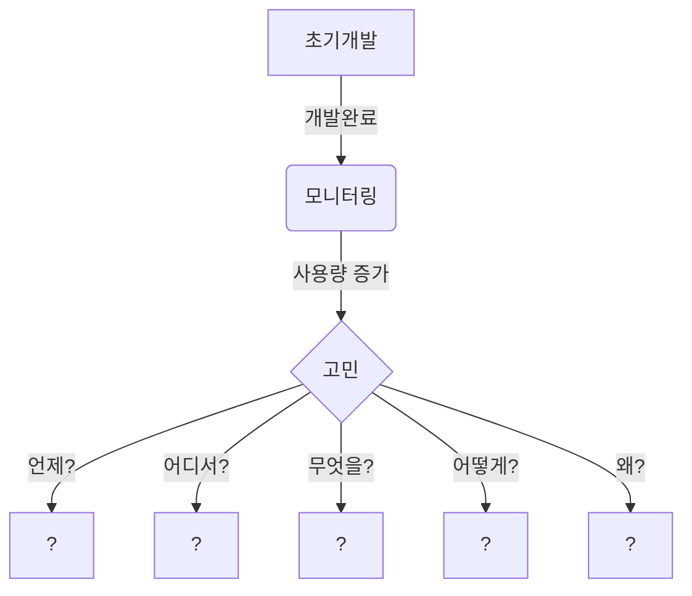

# 사용자 수에 따른 규모 확장성

- 초기 서비스는 Monolithic 시스템을 바탕으로 구성되어야 한다. 
  - 손쉬운 배포 
  - 테스트 간소화
  - 유지보수 편리성
  - 리소스 최적화 
  - 초기 단계 프로젝트 또는 소규모 팀에 적합 

- 초기 서비스에 대한 모니터링을 통해서 확장 시점을 정의 해야 한다. 

## 언제 확장해야 하는가? 

## 언제? 

- 모니터링을 통해서 정량적인 수치를 파악해야한다. 
  - [Pin Point](https://github.com/pinpoint-apm/pinpoint)
  - [Scouter](https://github.com/scouter-project/scouter)
  - [Prometheus](https://prometheus.io/)
  - [Grafana](https://grafana.com/)

### 정량적인 수치는 

서비스의 Scale-Up/Scale-Out이 일어나야 하는 시점을 파악하기 위한 임계치를 어떻게 정의할 것인가? 

- CPU 사용량 
- 응답시간
- 오류율 
- 트랙잭션 추적
- 인스턴스 수 
- 요청 
- 가동시간 

## 어디서? 

- OnPremise 인가? 
- Cloud 인가? 

### OnPremise 일 경우,

OnPremise 환경은 Cloud 환경과는 달리 확장 방식에 어려움이 있다.   
여기에서 의미하는 OnPremise 환경은 Container 기반의 시스템을 운영하지 않고,  
물리적으로 하드웨어가 고정된 경우를 의미한다.

> OnPremise 환경에서는 ScaleUp 방식이 좀더 쉬울 수 있다. 

### Cloud 일 경우, 

하드웨어를 논리적으로 확장할 수 있는 구조이며, 사용자의 트래픽에 좀더 능동적으로 대응 할 수 있다. 

- Virtual Machine 방식
- Container 방식

> Cloud 환경에서는 ScaleOut/ScaleUp을 자유롭게 처리할 수 있으며, ScaleOut을 효과적인 방법으로 처리할 수 있습니다. 

## 무엇을?

### 처리할 것인가?

- CPU/Memory 
- Database 
- Cache 
- Network
- Software Architecture
- Static files

### ScaleUp을 통한 확장

- 하나를 깊게,

### ScaleOut을 통한 확장 

- 작고 많게,